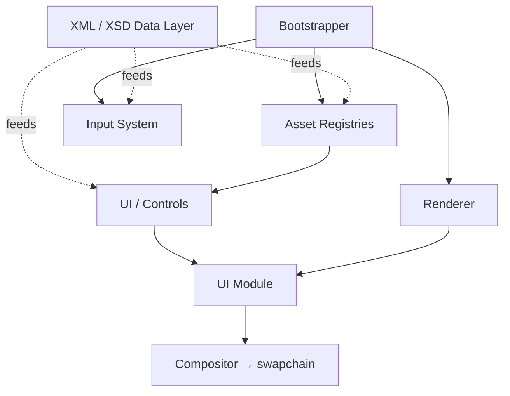

---
tags:
  - Engine
  - Aurora
  - d_System
cssclasses:
  - Aurora.css
Status: Current
Repository: https://github.com/NexerG/Project-Aurora
---

The Engine that started as a WinForms app to simulate liquid using SPH in 2D to OpenTK to Vulkan to this.
This document is the landing page for the engine's documentation — its systems and the tools made with it.

## System map
%% High-level only. Swap for an Excalidraw map when ready: ![[Engine Architecture.excalidraw]]
   (wikilinks don't resolve inside mermaid, so the clickable links live in "Systems" below). %%

## Systems — start here
The conceptual, read-end-to-end docs. Begin at the system, drill into its classes.

- [[Bootstrapper]] — XML-driven startup sequencing
- [[XML-XSD]] — the data layer (schema generation + XML parsing) that underpins everything
- [[INPUT]] — keyboard/mouse/gesture keybinds
- [[VULKAN]] — Vulkan setup & conventions
- **Rendering** — [[Renderer Module]] (active, module + compositor) · [[Vulkan Renderer]] (legacy / `[Obsolete]`)
- **Data / assets** — [[Asset Registries]] · [[Serializer]] · [[Paths]]
- **UI** — [[Vulkan Control]] and its derived controls / containers

## All documentation
%% Auto-maintained from frontmatter — no hand-edited tree to keep in sync.
   Switch views in the embed: All docs · Systems · Classes · Needs attention. %%

![[Engine Docs.base]]

## Conventions
- [[Attributes & Conventions]] — engine attributes, `d_*` tags, `Status` values, bootstrap step names
