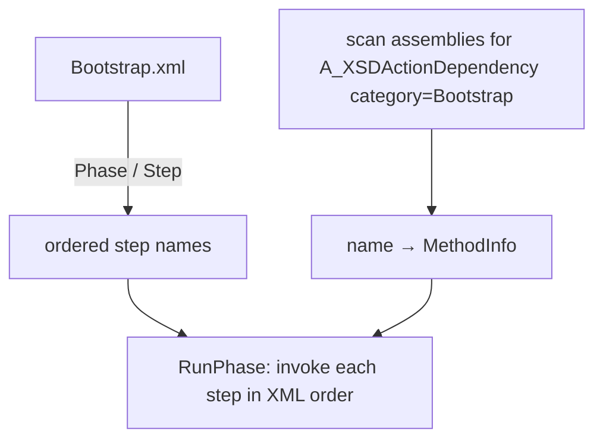

## Overview

The bootstrapper decides **what order the engine starts up in** — and nothing else. It does not contain startup logic itself; each step is an engine method living in its own system (registry, input, renderer, …). The sequence is declared in `Bootstrap.xml`, so reordering or inserting a startup step is an XML edit, not a code change. This replaces the old hardcoded `A_BootstrapStage` enum approach.

## Architecture



### Step resolution
`Bootstrapper.Load(xmlPath)` does two things:
1. Reflects over every loaded assembly and collects each method tagged `[A_XSDActionDependency(name, "Bootstrap")]` into a `name → MethodInfo` map.
2. Parses `Bootstrap.xml` into `phase name → ordered list of step (action) names`.

`RunPhase("Bootstrap")` then walks the step list in declared order, looks each name up in the map, and invokes it. An unknown step name is logged and skipped (non-fatal).

## Lifecycle / Flow
1. `Engine.Init()` calls `Bootstrapper.Load(Paths.BOOTSTRAP)` — `Paths.BOOTSTRAP` resolves `Bootstrap.xml` through the [[XML-XSD]] / VFS layer (engine default unless an app overrides it).
2. `Bootstrapper.RunPhase("Bootstrap")` invokes the steps.

The default step order is listed in [[Attributes & Conventions#Bootstrap step names]].

## Data / XML formats

```xml
<BootstrapSequence xmlns="http://arctisaurora/AuroraBootstrapTypes">
  <Phase Name="Bootstrap">
    <Step Action="EntityRegistry.ParseXML"/>
    <Step Action="InputHandler.LoadInputs"/>
    <!-- … -->
    <Step Action="Renderer.CreateSyncObjects"/>
  </Phase>
</BootstrapSequence>
```

`BootstrapSequence` → `Phase` → `Step` map to the `[A_XSDType]`-tagged classes `Bootstrapper`, `BootstrapPhase`, `BootstrapStep`, so the format is part of the generated XSD.

## Invariants & gotchas
- A `Step`'s `Action` string must match the `[A_XSDActionDependency]` **Name** exactly.
- Order is whatever the XML declares — **not** reflection order (reflection order is undefined).
- A missing/typo'd action is skipped with a console warning, not an exception — a step silently not running is the most likely failure mode.
- Planned rework (see engine notes): dependency-based sequencing driven further by XSD/XML.

## Key types
- `Bootstrapper` (static) · `BootstrapPhase` · `BootstrapStep`

## Related systems
- [[XML-XSD]] — supplies the attribute + parsing machinery
- [[Asset Registries]], [[INPUT]], [[VULKAN]] — register the steps that run here
