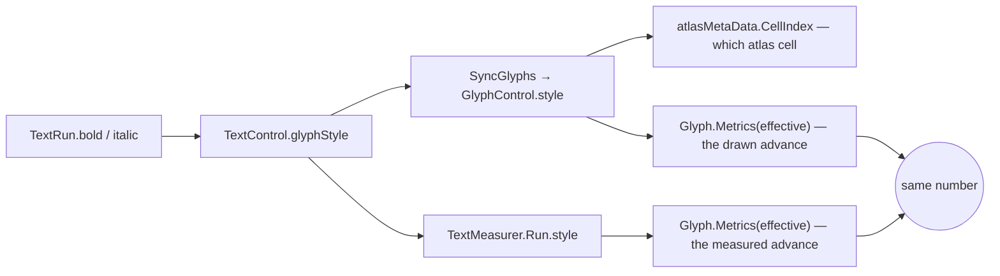

## Overview

Formatting is one primitive and a bar that drives it. Bold, italic and text colour are all a range restyle; heading and body are a block's styling type. Everything the bar can do, a keybind can do, because both call the same two methods on the document.

A run carries its own style, and a face of the family is part of that style rather than a separate font asset — the family bake puts regular, bold and italic in one atlas, so a bold run is the same font at another cell.

## The style seam

`TextControl.glyphStyle` is the single question the text layer asks about which face to cut. It is `Regular` at the base and `bold ? Bold : italic ? Italic : Regular` on `TextInputControl`, and it is read in three places: when glyphs are built, when they are repointed, and when the measurer is handed a run.

Bold wins over italic, because the importer bakes at most three faces and there is no bold-italic cell to point at.

Both sides of the pipeline resolve their metrics through the same expression, so the drawn advance and the measured advance cannot disagree.

The line box is deliberately left on the family's regular metrics. A line is as tall as the styles on it and not as tall as the letters that landed there, so a bold word must not make its line taller.

## Restyling a range

`ApplyStyleBetween` is the only thing that restyles text. It splits the range's ends out of whatever runs hold them, applies the change to every run between, and folds back together whatever the change made identical — so a document does not accumulate a run boundary per edit.

A `StyleDelta` is a set of nullable members, and a null member is one the change does not speak to. That is what lets bold over a multicoloured selection keep every colour in it.

Inside a block the range is addressed by character offset rather than by run index, because a split renumbers every run after it and the merge renumbers them back. The text itself never moves, which is what makes an offset stable and a recorded address replayable.

`ApplyLayout` runs between the split and the change: a run the split just cloned carries no line height, and running it afterwards would overwrite a font size the change had just set.

## Undo

A style change moves no text, so its inverse is simply the run partition and the styles that were on it. `StyleRangeEdit` carries a snapshot of every block the range touched and rebuilds their runs from it; redo replays the forward call, which resolves again because undo put the partition back exactly. See [[UNDO]].

The cost is the text of the touched blocks, so a select-all restyle records the note — the same class of cost a select-all delete already has.

## The bar

`DocumentToolbar` holds no editor. Each button asks who is focused at the moment it is pressed, walking up from the active control exactly as the keybinds do.

That works only because nothing in the bar takes the active control. The caret's run keeps it, so the walk still starts inside the note — and the price is that a tool button acts on press rather than on release, since a control that never becomes active never receives a release.

A dropdown's entries capture the editor when the menu opens and close over it, because a menu item is an ordinary button and does take the active control.

There is one bar per window, above the split, rather than one per editor: a tab item holds a single child and the tab view reads its editor out of that slot, so seating a bar beside the editor would break closing, finding and tearing off a tab.

The bar reflects the run the selection starts in, not the run the caret sits in — the caret end normalizes forward, so a range that ends on a run boundary sits in the run after the one it covers.

## The size field

The px box is the one control in the bar that does take the active control, because a field cannot be typed into without it. It works by capturing its target on the way in and handing the context back on the way out.

The capture happens on the press. The collision handler moves the active control before it delivers the click, so by the time the box hears about it the note has already lost the caret — but nothing has touched the note's selection yet, which makes the press the last moment the range can be read. What it captures is the range as two addresses rather than a promise to ask again later, so the size lands on the text the user had selected when they reached for the field.

Enter applies and hands the caret back to the note. Escape hands it back and changes nothing. Losing the focus to a click elsewhere abandons the edit and leaves the active control where the user put it — a blur is not a cancel, and a bar that grabbed the caret back on the way out would fight the click that caused it.

With nothing selected the field changes nothing. A size that applies to what you type next is a pending style, and no such thing exists yet.

A size only sticks because a run remembers that somebody chose it. The block's layout pass writes the styling scheme's size into every run it owns, including runs a split has just cloned, so a run whose size was authored is marked and skipped — and the same mark is what carries the size through a clone, an undo snapshot and the file on disk.

## Bindings

| Action | Bound to | Acts on |
|---|---|---|
| `Text.Bold` | Ctrl+B, and the bar's B | the selection, toggled from its first run |
| `Text.Italic` | Ctrl+I, and the bar's I | the selection, toggled from its first run |
| block styling | the bar's type dropdown | every block the selection touches, or the caret's own |
| text colour | the bar's colour dropdown | the selection |
| font size | the bar's px field, committed with Enter | the range that was selected when the field was clicked |

## Not here yet

Alignment needs a block-level line-width pass, which has not existed since each control started measuring itself — no run knows the width of a visual line it shares with its neighbours.

Strikethrough is declared on a run and read by nothing.
