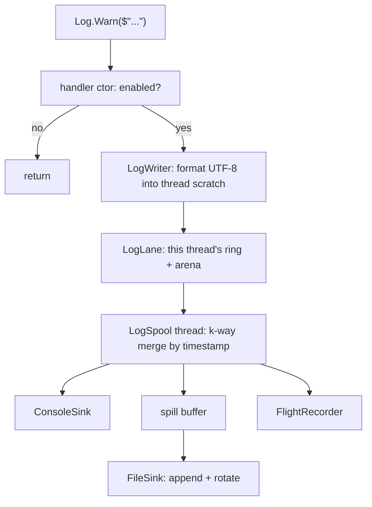

## Overview

Logging is a write into thread-local memory and nothing else. The calling thread formats one line as UTF-8 into its own scratch buffer, copies it into its own lock-free lane, and returns; a single background thread merges every lane by timestamp and feeds the console, the log file and a crash recorder. No game thread ever opens a file or takes the console lock, which is the whole reason the engine's three free-running threads can log at all.

A level that is switched off costs one field load and a predicted branch, because the interpolated string is never built — see [[#Why a disabled call is free]].

## Architecture



### Channels
A subsystem holds one channel as a static readonly field, and the channel carries the minimum level it will accept, so a call resolves to a field load rather than a name lookup.

```csharp
static readonly LogChannel Log = LogChannel.For("Renderer");

Log.Warn($"no device matching '{preferred}' — using {DeviceName(gpu)}.");
```

The channel names in use are `Bootstrap`, `Shutdown`, `Settings`, `XSD`, `XML`, `Context`, `Engine`, `Threading`, `Data`, `Assets`, `Input`, `UI`, `Renderer`, `Vulkan`, `Crash`.

### Levels
`Hot`, `Trace`, `Debug`, `Info`, `Warn`, `Error`, `Fatal`, `Off`. `Hot` is `[Conditional("DEBUG")]`, so both the call and its interpolation literals vanish from a Release build; everything else stays runtime-gated so a shipped build can be asked for verbose output. A record at `Warn` or above also carries its `@File.cs:line`, which the compiler supplies for free.

### Why a disabled call is free
The handler's constructor takes an `out bool`, and when it comes back false the compiler emits none of the `AppendFormatted` calls at all — so the interpolation holes are not merely discarded, they are never evaluated.

```
LogWriter.Begin(channel, level, out enabled):
    if channel is null or level below channel.min:
        enabled = false
        return default          // Started stays false; Emit does nothing
    enabled = true
    return writer over this thread's scratch span
```

There is one handler type per level, because the level has to reach that constructor and the compiler only passes the receiver into it. Each handler carries a second constructor taking a `LogGate`, which is what lets the plain call and the rate-gated call share one type.

### Rate gates
`[CallerFilePath]` and `[CallerLineNumber]` are compile-time constants, so a call site is its own key and nothing has to be named by hand.

```csharp
Log.Every(1000).Hot($"module {i} re-recording image {imageIndex}");
Log.Once().Warn($"descriptor pool at {used}/{cap}");
```

Without this, one bad state inside the render loop writes a hundred and forty lines a second and the log stops being readable.

### Lanes
Each engine thread owns a `LogLane` — a ring of fixed-size records plus a byte arena for their text, with one volatile store in each direction. It is the same shape as `CommandLane` and `CommandArena` in the [[ECS]] command system, and for the same reason: one writer and one reader per ring means an enqueue is a store and a cursor bump rather than a contended compare-and-swap. It is a deliberate copy rather than a reuse, because the command system logs and a diagnostics namespace that depended on it would close the loop.

Threads that are not one of the engine's systems share a single lane behind a lock, which in practice means GLFW callbacks and the Vulkan validation callback.

Every record is stamped with the producing system and its epoch, so a three-thread interleave can be put back in order by eye:

```
20:04:59.953 INFO  Render:1423 [Renderer] rebuilding swapchain — acquire returned out-of-date
```

### The spool
One background thread, woken by an event or a 250 ms poll. It snapshots every lane, walks them as a k-way merge on the record timestamps so the output is in the order things actually happened, composes each line into a reusable buffer, and hands it to the sinks.

```
DrainOnce():
    apply a pending configuration if one arrived
    BeginDrain every lane
    loop:
        pick the lane whose next record has the earliest timestamp
        compose that record into the line buffer
        publish it to the sinks
    EndDrain every lane, reporting anything the ring had to drop
    spill if an error was seen, or the buffer is half full, or FlushMs has passed
```

## Lifecycle / Flow
1. The first `LogChannel.For` starts the spool thread. This happens before [[Bootstrapper]] runs, because `XSDGenerator` logs and it runs before `Engine.Init`.
2. Until configuration lands, the console prints at a fixed `Info` default and every line is also held in memory.
3. `Logging.Configure` is the second step of `Bootstrap.xml`, immediately after `Settings.LoadAll`. It reads [[SETTINGS]], opens the file sink, allocates the recorder, and replays everything held so far at its real level — so nothing from early boot is missing from the file.
4. `Logging.Flush` is the last `Commit` step of `Shutdown.xml`. It stops the spool, drains what is left and closes the file.

## Data / XML formats

```xml
<Logging>
  <LogConsole MinLevel="Info"/>
  <LogFile MinLevel="Debug" Directory="Logs" Name="engine"
           BufferKB="64" FlushMs="2000" MaxFileMB="16" Keep="5"/>
  <LogRecorder Enabled="true" MinLevel="Trace" CapacityKB="512"/>
</Logging>
```

`Directory` is relative to the folder holding the application's settings, so Periodic writes to `%AppData%/Periodic/Logs`; an absolute path is taken as given, and an application that never set a write root falls back to a `Logs` folder beside the executable.

The level a channel gates on is the **lowest** of the three, not the console's, because the recorder captures below what anything prints and those lines still have to be formatted.

## The file, and what survives a crash

Lines accumulate in a buffer and reach disk on any of three triggers: the buffer passing half full, `FlushMs` elapsing, or any record at `Error` or above. The last one is the important one — the line you most want on disk is the one immediately before the thing that killed you.

The file is opened shared-for-read so it can be tailed while the engine runs, and rolls to `engine.1.log` through `engine.{Keep}.log` once it passes `MaxFileMB`.

The recorder is a circular buffer that captures below whatever the file is filtering to and never touches disk in the steady state. It is dumped once, on a crash, and only when it is actually capturing below the file level — otherwise every line in it is already on disk. It exists for the configuration where the file is kept quiet at `Warn` and the tail is kept at `Trace`.

A managed crash is caught at the top of the system loop, logged with its stack, dumped, and then **rethrown** — a system that has died has to take the process with it rather than leave the rest of the engine spinning against a thread that stopped answering. A hard native fault runs none of that, which is why the time-based flush matters.

## Gotchas
- Do not log per frame. `LastTickMs` and `GpuEngineStats` already exist and go to the shaders; that is telemetry, not logging. A line per frame at 120 Hz is seven thousand a minute.
- The spool is a plain thread, deliberately not a `ThreadedSystem` — it owns no pools, and being one would hand it a system id and a set of command lanes it would never read.
- Never read back through the scratch buffer or the arena from another thread; the lane protocol is the only synchronisation there is.
- `Log.Hot` does not exist in Release. Anything that must survive a Release build goes at `Trace` or above.
