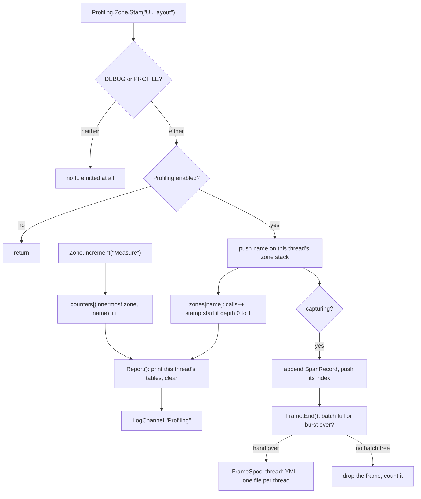

## Overview

Profiling answers "where did this tick go", inside a tick rather than around it. Two things already measure a tick from the outside and are not replaced by this: `ThreadedSystem.LastTickMs` is each thread's wall time and feeds `deltaTime`, and `GpuEngineStats` publishes those same three numbers to every shader. This is the layer beneath them.

There are two primitives. A **zone** is a timed span, opened and closed by name. An **increment** is a bare counter that attributes itself to whichever zone is currently open, and never reads the clock. That split is the design: a zone costs two `Stopwatch.GetTimestamp()` reads, an increment costs a dictionary hit, so an increment can sit inside a loop that a zone would drown.

Every entry point is compiled out unless `DEBUG` or `PROFILE` is defined, so a build with neither carries neither the calls nor the zone-name strings.

There are two ways to read what it collects. The **report** is a log line per zone, once a second, summarising the period — off by default. A **capture** is the other end of the scale: every span of every frame, in order and nested, written to an XML file for something else to draw.

## Architecture



### Using it
A zone wraps the span you want timed, and increments inside it count whatever ran within.

```csharp
Profiling.Zone.Start("UI.Layout");
    Profiling.Zone.Increment("Measure");
    Profiling.Zone.Increment("Arrange");
Profiling.Zone.End("UI.Layout");
```

Zones nest, and an increment always attributes to the innermost one that is open on the calling thread. An increment with no zone open attributes to `(root)` rather than being dropped. Counters are keyed by zone as well as by name, so `Measure` counted under `Layout` and under `HitTest` reports as two separate numbers.

`Report()` prints the calling thread's tables and clears them, at most once a second. It runs at the end of every `ThreadedSystem` tick, so each thread reports its own line and no thread ever reads another's tables. The printing is gated by `ProfilingReport.Enabled` and is **off by default**; the period still rolls and still clears when it is off, so nothing accumulates forever. The gate covers the whole log call, so switching the report off takes it out of the log file and the flight recorder as well as the console.

### What is instrumented today
`MainTick` carries `MainTick`, `PollEvents`, `ActivateKeybinds`, `HandleUI` (with a `Window` counter), `Interpolate` and `FrameEdge`. `RenderSystem.Tick` carries `RenderTick` and `Draw`. Inside it, `Renderer.Draw` carries `Draw.Wait`, `Draw.Acquire`, `Draw.Update`, `Draw.Submit` and `Draw.Present`, and `Renderer.RecreateSwapchain` carries `Swapchain.Recreate` with `Swapchain.WaitIdle`, `Swapchain.DestroyOutputs`, `Swapchain.Destroy`, `Swapchain.Create`, `Swapchain.ResizePerImage`, `Swapchain.CreateOutputs` and `Swapchain.Descriptors` under it. The frame edges themselves are in `ThreadedSystem.Loop`, so every system has them, physics included.

Under `ResolveLayout`, aimed at what a window resize costs: `UIEngine.ResolveLayout` carries `Layout.Measure`, `Layout.Arrange`, `Layout.SubtreeCache` and `Layout.VerifyCache` per root (with a `Root` counter); `DocumentControl` carries `Document.MeasureBlocks`, `Document.ArrangeBlocks` and `Document.ArrangeOverlays`; `TextRunControl.Measure` carries `Text.BuildRuns` and `Text.MeasureBlock` for every run that actually rewraps; `DocumentEditorControl.Arrange` carries `Editor.Rearrange` only when scrolling to the caret moves the view.

Outside the tick loop, `Bootstrapper.RunPhase` carries a zone named for every bootstrap step and brackets the whole phase in a frame of its own.

### Re-entering a zone
A zone entered again while already open does not start a second timer. It deepens the one already running.

```
Zone.Start(name):
	push name on the thread's stack
	zone = zones[name]
	zone.calls += 1
	if zone.open == 0
		zone.openStart = Stopwatch.GetTimestamp()
	zone.open += 1

Zone.End(name):
	check name against the top of the stack, warn if it differs (DEBUG only)
	pop the stack
	zone = zones[name]
	zone.open -= 1
	if zone.open == 0
		elapsed = Stopwatch.GetTimestamp() - zone.openStart
		zone.totalTicks += elapsed
		fold elapsed into zone.minTicks and zone.maxTicks
```

The consequence is worth holding on to: for a recursive zone the accumulated time is the wall time of the **outermost** span only, so dividing it by the call count is not a mean per call, and min/max are over outermost spans. It is correct as inclusive time and misleading as an average. Zones that never re-enter are unaffected.

### Why the flags are two
`[Conditional("DEBUG"), Conditional("PROFILE")]` applies as an OR, so the profiler is live in a normal Debug build with nothing added to any project file, and `PROFILE` remains available to switch it on in any other configuration. Because `[Conditional]` removes the whole call expression, the string arguments are removed with it and the zone names never reach the assembly.

`Profiling.enabled` is a plain field rather than something the JIT can fold to a constant, deliberately: a folded constant has to settle in a static constructor, which is before settings are loaded, and it could never be flipped by a UI toggle afterwards. A build that carries `PROFILE` is a build that intends to profile, so it pays one predicted branch.

### Why nothing is shared between threads
The tables are `[ThreadStatic]`, and `Report` only ever touches the calling thread's own. Reading another thread's live `Dictionary` while it adds a key is not a torn number, it is a corrupted resize, so the alternatives were a lock on every zone edge, a published snapshot per thread, or not crossing threads at all. Not crossing is both free and smaller, and a line per thread is what you want to read anyway, since main and render are different budgets.

This is the one place the design deliberately diverges from [[LOGGING]], which does merge every thread's lane into one time-ordered stream.

A capture does cross threads, but by handing a buffer over rather than sharing one. The recording thread fills a batch, submits it, and never touches it again; the spool writes it and pushes it back onto that thread's free stack. The rule that matters — no thread reads another thread's live tables — still holds, and the cost is one lock acquire per batch instead of one per zone edge.

### Capturing frames
A capture records every span of every frame rather than a period's totals.

```csharp
Profiling.Capture();          // the next BurstFrames frames, then it closes the files
Profiling.Capture(1200);      // or a length of your own
Profiling.CaptureUntilFlush(); // every frame until shutdown's Profiling.Flush
```

`Profiling.Capture` is tagged as an `Input` action, so it can be bound to a key in an application's `InputMap.inputs.xml`; Thorium binds it to `F9`. Setting `ProfilingCapture.Mode` to `Continuous` starts one at launch instead and never ends it, rolling into a new session folder every `MaxFileMB` and keeping the last `Keep` of them.

While a capture is live, `Zone.Start` appends a record and `Zone.End` patches its end time. Opens happen in the order the zones nest, so the array is already in document order and needs no sorting. Nothing on the timed thread formats anything: `FrameSpool`, a background thread, does every `XmlWriter` call and every file write, which is the point — batching the writes without moving the formatting would only have relocated the cost.

Each thread holds three batches. If the spool falls behind and none is free, **frames are dropped and counted, never waited on** — a profiler that stalls the thing it measures is worse than one with a gap in it. The count surfaces as `Dropped` on the next batch written. Two gaps follow from never touching another thread's tables, and are accepted: drops still pending when a capture ends are not reported, and a partial batch held by a thread at shutdown is lost.

### Profiling a launch
Two ways to start a capture at launch rather than at a keypress, and they do not cover the same window.

```
Thorium.exe --profile          # BurstFrames frames of every thread, from boot
Thorium.exe --profile=1200     # or a length of your own
```

`Profiling.ArmBoot` reads that off the process command line and opens the session from `Engine.Init`, before the bootstrap phase runs — which is why **the bootstrap phase itself is captured**, as one frame holding a zone per step, written as `Bootstrap.frames.xml` beside the thread files. It lives in the engine rather than in each application's `Main`, so Thorium, Carbon and the Editor all take the flag without knowing about it.

Setting `ProfilingCapture.Mode` to `Boot` does the same for a run with no argument, and is the one to reach for when every launch should be profiled. It cannot capture the bootstrap phase: the setting is read by `Profiling.Configure`, which is itself a step of the phase in question, so the capture only opens in time for the first real frame. The flag wins when both are set.

Neither reaches `XSDGenerator.GenerateXSD()`, which every application runs in `Main` before the engine is initialised at all.

One number to read carefully: `--profile=N` is N frames **per thread**, and on the main thread the bootstrap frame is one of them. A 120-frame capture writes 1 boot frame and 119 main frames, against a full 120 each from render and physics.

### A scenario
`--profile-scenario` records typing and a window resize on a 1,000,000-character note in one capture, with nobody at the keyboard, and quits when it is done.

```
Thorium.exe --profile-scenario
```

`ProfileScenario.Arm` reads the flag from `Engine.Init`, right after `ArmBoot`. It points the settings write root at a `ProfileScenario` folder beside the application's own, because the scenario replaces the window's tree and shutdown would otherwise save that empty layout over the real one. Captures and the log still land in the application's usual folders, so Carbon lists the session with the rest. The scenario itself is an entity, so it runs once a tick inside `Interpolate`, before layout resolves — an edit and the remeasure it causes land in the same frame.

```
ProfileScenario.OnTick()
	tick += 1
	if tick is 2
		build 1,000 paragraphs of 1,000 characters into a note
		replace the primary window's tree with one editor showing it
		put the caret at the end of the first paragraph and focus the editor
	if tick is 30
		Profiling.CaptureUntilFlush()
	if tick is 31 to 150
		zone Scenario.Type
			queue one character and run Text.Write, the same action a key press runs
	if tick is 151 to 270
		zone Scenario.Resize
			set the window 8 px narrower each tick for 60 ticks, then 8 px wider back to where it started
	if tick is 271
		log the note's length and the window's size
		post Shutdown.Request
```

The tree waits until tick 2 so the application's own tree has been laid out once before it is destroyed. Destroyed any earlier, layout still ran over it and built children under controls that were already dead, and those children outlived the tree and stopped the UI pool from resequencing on every frame of the capture.

In the file, frames carrying `Scenario.Type` are the typing half and frames carrying `Scenario.Resize` are the resize half. Each resize frame rewraps every paragraph inside `ResolveLayout`. A run counts toward `Keep` like any other capture, so it prunes the oldest session. The editor has no file behind it, so no undo records are made, which a real keystroke would pay for. See `ClaudeMemory/Decisions/engine-profiling.md` §15.

### The frame file
One file per thread, `Profiling/<yyyyMMdd-HHmmss>/<thread>.frames.xml`.

```xml
<FrameCapture Thread="Main" Frequency="10000000" Started="…" Mode="Burst" Requested="300">
  <Names><N I="0" V="MainTick"/><N I="1" V="HandleUI"/><N I="2" V="Measure"/><N I="3" V="UIElements"/></Names>
  <Batch Seq="0" Dropped="0">
    <F I="10412" T="8823410992341" D="91004" A="350072">
      <Z N="0" B="0" E="83120" A="300048">
        <Z N="1" B="4903" E="12142" A="200024"><C N="2" V="412"/></Z>
      </Z>
      <P N="3" C="98" K="1024" M="167936"/>
    </F>
  </Batch>
</FrameCapture>
```

`F` is a frame — `I` its index (the system's epoch), `T` the `Stopwatch` stamp it started on, `D` how long it took, `A` how many bytes it allocated. `Z` is a span and `C` a counter, `B` and `E` are ticks measured from the frame's own `T`, `A` is the span's own bytes, and `N` is an index into `Names`. `P` is a data pool as the frame left it, written only when pools are being profiled — `C` its live items, `K` its capacity, `M` its reserved bytes. Everything is a raw tick or byte count with `Frequency` at the top, because formatting a millisecond figure costs more than the span being measured; the reader divides.

Three consequences worth holding on to. The nesting of the elements is the nesting of the zones, so the file **is** the flame chart and nothing has to be reconstructed. `T` is process-wide, so two threads' files stack on one timeline without a correlation id — the render thread's wait sits directly under whatever main was doing. And the gap between `D` and the root span's `E` is time the thread spent parked, which draws itself.

A file whose process died has no closing `</FrameCapture>`. That is deliberate — the last partial batch of a crashed run is worthless, so a reader is expected to tolerate the truncation. A clean exit closes it through `Profiling.Flush`, the shutdown step before `Logging.Flush`, which first waits for every thread to hand over the frames it is still holding — each one does at its next frame edge, and main, which is running the step, hands its own over directly.

```
Profiling.Flush()
	end the capture
	hand the calling thread's batch to the spool, dropping the frame it is in the middle of
	wait until no thread holds a batch, for at most 2 seconds
		if it timed out
			warn how many batches were lost
	stop the spool, which writes what is left and closes every file
```

One shape in the file catches readers out: a `Z` with no children and no counters is written self-closing, as `<Z N="3" B="84947" E="94958" />`, so nothing can wait for a closing tag that will not come. `A` is omitted from a span that allocated nothing, and from one the frame edge cut off before it closed; a file written before allocation was recorded reads back as zero rather than failing.

### Allocation
Every span and every frame also carries how many bytes the thread allocated inside it, sampled with `GC.GetAllocatedBytesForCurrentThread()` — a thread-local read that allocates nothing itself, taken at the same gates as the clock.

Bytes behave exactly like time. They are **inclusive**, so a parent's number contains its children's; the aggregate follows the same outermost-only rule as a recursive zone's duration, and the capture stream records every instance. Per-thread means per-thread: work a zone hands off to a pool thread is not in its bytes.

The measured window opens at the *end* of `Frame.Begin` and closes at the top of `Frame.End`, which is what keeps the profiler out of its own numbers at both ends: the lane and the three batches a starting capture builds are already allocated by the time the window opens, and the one-second report's string building happens after it has closed, so neither inflates a frame. The residue is what the profiler grows *during* a tick, which it cannot exclude without measuring itself at every zone edge — the first `Zone.Start` on a thread grows the report dictionaries by a few hundred bytes, and a batch whose frames overflow its span array doubles it, one ~160 KB spike on whichever frame crosses the line.

**Bytes collected are not recorded.** The runtime does not expose bytes freed, and the one API that gives real per-collection detail, `GC.GetGCMemoryInfo()`, allocates — a profiler that allocates to measure allocation corrupts its own measurement. Collection counts and a derived reclaimed figure are described in `ClaudeMemory/Decisions/engine-profiling.md` §12 and were deliberately not built.

### Pools
A capture can also record every `DataPool` each frame: how many items it holds, its capacity, and the bytes it has reserved. It is off by default, because most captures are about time — turn it on with `<ProfilingCapture Pools="true"/>` in the settings, or for one run with `--profile-pools` on the command line, which switches it on whatever the setting says. The switch only adds pools to a capture; it does not start one, so it goes beside `--profile` or an F9 press.

The pool reports itself, from the thread that owns it, right after it settles:

```
DataManager.FrameEdge()
	for each pool
		pool.FrameEdge()
		Profiling.Frame.Pool(pool.Name, pool.Count, pool.Capacity, pool.ReservedBytes)

Profiling.Frame.Pool(name, count, capacity, bytes)
	if profiling is off or pools are not being recorded
		return
	if this thread is not capturing the current frame
		return
	append a pool record to the batch
```

Sampling after `FrameEdge` means a freed row is already gone, so the count is what the pool carries into the next frame. The profiler never walks the pools itself — a pool may only be read on the thread that owns it, and the pool's owner is exactly who calls this. Every pool is owned by Main today, so pools appear only in `Main.frames.xml`.

Reserved bytes are the capacity times the size of one slot, and a slot is every column's element plus the pool's own bookkeeping — the slot map, back map, versions, published versions and owner reference, 24 bytes. Because every array the pool holds is sized to its capacity, the bytes actually in use are exactly `M × C / K`. What is not counted: array headers, the small side tables, the objects an owner reference points at, and any GPU buffer a pool is mirrored into. See `ClaudeMemory/Decisions/engine-profiling.md` §14.

### Reading it back
`FrameCaptureReader` is the other half of `FrameSpool`, in the same namespace, and is `WriteFrame` run backwards — element nesting is the span depth, so the flat arrays come back the way the recording thread built them. `Enumerate(root)` lists session folders without parsing anything, `LoadSession(dir)` reads every thread file in one, and `LoadFile(path)` reads one. Truncation is expected rather than exceptional: what was read is kept, `truncated` is set, and the frame the writer died inside is dropped because nothing references its spans.

The viewer that draws these files is **Carbon**, a fourth application on the engine's own UI beside Thorium and the Editor. It shows the session list, a bar per frame per thread, one frame's flame chart, every thread aligned on the absolute clock, and the zone totals rolled up over the capture. The flame chart and the timeline open one third and two thirds of the column and a grip between them drags that ratio, since a boot capture wants most of its room in the flame chart and a three-thread session wants it in the timeline. See `ClaudeMemory/Decisions/carbon-frame-viewer.md`.

Two captures compare in the zone table. **Pin as baseline** keeps the loaded session, and every session loaded after it shows each zone as milliseconds per frame beside its change against the same thread and zone in the baseline, slower in red and faster in green, until **Clear baseline**. The comparison is per frame because a total is a sum over however many frames the file holds, and two captures rarely hold the same number.

While a baseline is pinned a second frame strip sits under the first: the baseline on top, the capture loaded after it below, and **Swap** trades them. Both strips give a thread the same lane and the same frame columns, sized to whichever capture holds more frames, so frame N sits at the same x in both. **Slide left** and **Slide right** move the lower strip's frames one column at a time to line a spike up with its counterpart, and swapping negates the offset so the alignment holds. **Scale** runs from 0, where each lower lane is drawn against its own longest frame, to 1, where it is drawn against the upper strip's longest frame for that thread. The flame chart and the timeline show whichever bar was clicked last, in either strip.

A capture with pools in it shows them twice. The zone table closes each thread with a **pools** block, one row per pool with its peak bytes beside the name and its item range, last count and peak capacity under it. A line under the frame strips reads out the pools of whichever frame was clicked last — name, items over capacity, bytes — and stays empty for a thread that recorded none.

### Reading the output
```
Main 1002ms — allocated 12.41MB
Main 1002ms — MainTick 8.31ms x120 (min 7.902 max 9.421) 11.90MB
Main 1002ms — HandleUI 5.10ms x120 (min 4.880 max 6.114) 3.21MB — Window 120
Render 1001ms — Draw 6.02ms x144 (min 3.910 max 9.008) 84.2KB
```
The first line is the whole thread over the period, including whatever ran outside any zone. Then per zone: the period the line covers, the zone's accumulated time, its entry count, the shortest and longest completed span, and its bytes. Counters for that zone follow the dash.

### Not here yet
GPU timings are out. When frame times are read back from a `VkQueryPool` they will land on the same tables through a submit that carries its own start and end stamps, which is part of why the API is `Start`/`End` rather than a `using` scope — a GPU span closes frames after the code that opened it has returned. Bytes collected, collection counts and GC pause time are out too, for the reasons above.

The report is a log line and the capture is a file — neither is a panel. The reader and its viewer landed as **Carbon** (above); the UI-hosted test and profiling platform is still the roadmap item this was built to feed. There is still no `.xsd` for the frame format: the reader is hand-written and is the only consumer, so a schema would validate nothing but files the engine itself wrote.
