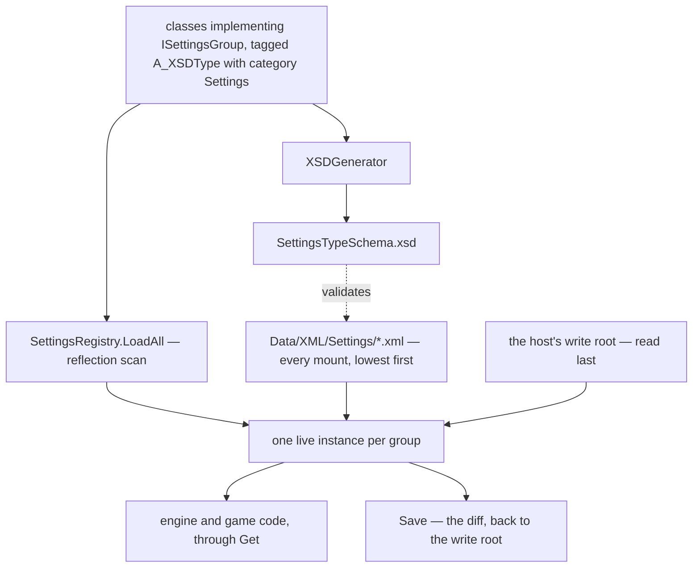

## Overview

The system that lets an engine, an application built on it, and the person using that application each have an opinion about the same value, and lets the last of those three survive the other two changing underneath it. A *settings group* is an ordinary C# class carrying the two attributes every serialized type in the engine already carries; the registry finds it by reflection, fills it from XML that cascades across the [[Virtual File System]]'s mounts, hands it to whoever asks, and writes back only what the user actually changed.

It is deliberately not an asset system. [[Asset Registries]] answers "give me the thing named X", where a thing that no manifest declares does not exist; settings answer "what is the value of X right now", where a value nobody has ever overridden is still a value. That difference is why discovery here is a type scan rather than a manifest read, and why a group with no file anywhere on disk is perfectly normal.

## Architecture



Three things feed a group and they arrive in a fixed order: the field initializers in the C# class, then every manifest the mounts carry, then the host's write root. Nothing that arrives later is obliged to be complete — each tier overrides only the attributes it names.

## Adding settings to a game

The whole cost is a class. There is no registration call, no manifest entry, and no file.

```C#
[A_XSDType("Rendering", "Settings")]
public class RenderSettings : ISettingsGroup
{
    [A_XSDElementProperty("Vsync", "Settings")]
    public bool vsync { get; set; } = true;

    [A_XSDElementProperty("Device", "Settings")]
    public string device { get; set; } = "auto";
}

bool vsync = SettingsRegistry.Get<RenderSettings>().vsync;
```

`ISettingsGroup` carries no attribute of its own, exactly as `Block` doesn't — it is there to be the `allowedChildren` target [[XSDGenerator]] scans when it emits `SettingsManifest`, and the filter the registry's scan uses. Every group uses the `Settings` category so that one schema and one namespace cover all of them and one file can hold groups from unrelated systems; the grouping you care about is the type name, not the category.

The one trap is naming. XSD type names are a **flat namespace across every category** — `AnyXMLType.FindType` matches on name alone — so a group called `Document` would collide with `RichTextDocument`'s `[A_XSDType("Document", "UI")]` and the file would silently fail to resolve. Check before naming.

Shipping defaults for the group is a file in `Data/XML/Settings/`; not shipping one is equally valid and means the field initializers are the defaults. A host that wants its users to be able to change anything calls `SettingsRegistry.SetWriteRoot(path)` once, before `Engine.Init`, and `SettingsRegistry.Save<RenderSettings>()` whenever a settings screen is dismissed.

## Lifecycle / Flow

1. `Settings.LoadAll` is the **first** step of the `Bootstrap` phase in [[Bootstrapper]], so every later step and everything at runtime can read a group without checking whether it is ready.
2. The scan constructs one instance per `ISettingsGroup` implementer across all loaded assemblies. Everything below this point is override.
3. Every mount's `Data/XML/Settings/*.xml` is applied, **lowest-priority mount first** — engine, then application — files within a mount in name order.
4. Every group is snapshotted. This is the baseline a save later diffs against, and taking it here is what makes "only what the user changed" mean the user and not the application.
5. The host's write root is applied last, and each group's stored element is kept for the save to read back.

`VirtualFileSystem.EnumerateAll` is deliberately not used for step 3: it de-duplicates by *file name*, so an application naming its file the same as the engine's would hide the engine's entire set rather than override the values it names. The registry walks `VirtualFileSystem.Mounts` in reverse directly.

## Resolution and merging

Scalars merge per attribute — an application that names `LineHeight` and nothing else keeps the engine's `BlockSpacing` and its whole style scheme. A nested complex member merges recursively onto the instance that is already there rather than replacing it.

A `List<>` member is the exception: the first file in a tier that declares any entry replaces the whole list. That is the rule [[Document Layout Engine]] already settled for text styles, and it is kept for the same reason — a scheme should be read as written, not merged entry-by-entry against entries its author cannot see and did not intend to inherit.

## Saving

`Save` writes one file per group into the write root, holding only what differs from the step-4 snapshot, so a user who changed one value pins one value and keeps receiving engine changes to everything else. A changed list is written whole, its entries still skipping their own type defaults. The write root is **not** a mount — mounting it would let a stray file there shadow engine *assets* and not just settings.

## Versioning and migration

Most ways a release changes the shape of a settings group need no mechanism whatsoever. A group that gains a member gets it from the field initializer, because the instance is built before any file is read and a user file that never named it says nothing about it. An enum that gains members still parses every name it used to. A brand-new group needs no file to exist at all.

What genuinely breaks a stored file is a name or a meaning moving out from under it: a member renamed, an enum member deleted, a 0–100 value becoming 0–1, a member moving to another group. None of that is inferable from the file, so a group that expects to change shape implements `IMigratableSettings` — an `int version`, and a `Migrate(int from, XElement stored)` that rewrites the stored element in place before anything on it is read. The rewrite is ordinary XLinq and the group spans its own versions, so there is no migration language and no step registry.

```
Migrate(from, stored):
    if from is below 2, rename the Vsync attribute to VerticalSync
    if from is below 3, divide Sensitivity by 100
```

A group migrates only when its stored element **carries** a `SettingsVersion` attribute lower than the group's own version. Hand-authored engine and application manifests never carry one and are therefore always read as current; `Save` stamps every migratable group, so user files always have one. `SettingsVersion` is reserved by the registry, and since [[XSDGenerator]] emits attributes from annotated members only it is the single attribute in a saved user file that the schema does not describe.

### Nothing the user owns is thrown away

An attribute in a user's file that no member claims is carried forward rather than dropped — `Save` starts from the fresh diff and copies back everything unclaimed, on the group element and recursively on nested members. A value survives a rename nobody wrote a migration for, and survives a setting that leaves in one release and comes back in another. A *known* attribute the writer chose to omit still drops out, so resetting a value to what the tiers below say still shrinks the file rather than pinning it forever.

A stored value that no longer converts at all — the enum member that was deleted — warns and leaves the member holding what it already had, instead of throwing. Before that tolerance existed such a value killed bootstrap at its very first step. It is asked for by the settings path alone: [[Document XML]] and the asset manifests still throw on a value they cannot read, because a note is not a file anyone hand-edits casually.

What is still not covered is a group **renamed or deleted outright**. The registry warns and skips, the user's whole file for it is orphaned, and `Migrate` cannot help because it is dispatched off a group that no longer resolves. Nothing prunes the write root either, so a dead group's file lingers.

## Data / XML formats

`Data/XML/Settings/*.xml`, any number of files, free filenames, unioned across mounts:

```xml
<SettingsManifest xmlns="http://arctisaurora/AuroraSettingsTypes"
                  xmlns:UI="http://arctisaurora/AuroraUITypes">
  <DocumentSettings>
    <UI:DocumentLayout LineHeight="1.5" BlockSpacing="8">
      <UI:TextStyle Type="Heading1" FontSize="34"/>
    </UI:DocumentLayout>
  </DocumentSettings>
</SettingsManifest>
```

A group whose type lives in another category carries that category's prefix on its subtree — `DocumentLayout` is a `UI` type because notes embed it and moving it would change the namespace of every saved note. Groups declared in the `Settings` category need no prefix at all.

A saved user file is the same format with a version stamp: `<HarnessRender SettingsVersion="3" Msaa="8"/>`.

## Related
- [[Settings Registry]] — the class: API, method shapes, the snapshot and diff machinery
- [[Virtual File System]] — the mount order the cascade walks
- [[Asset Registries]] — the manifest pattern this mirrors, and where the two systems part company
- [[Bootstrapper]] — `Settings.LoadAll` is the first step of the `Bootstrap` phase
- [[Document Layout Engine]] — `DocumentSettings`, the first consumer
