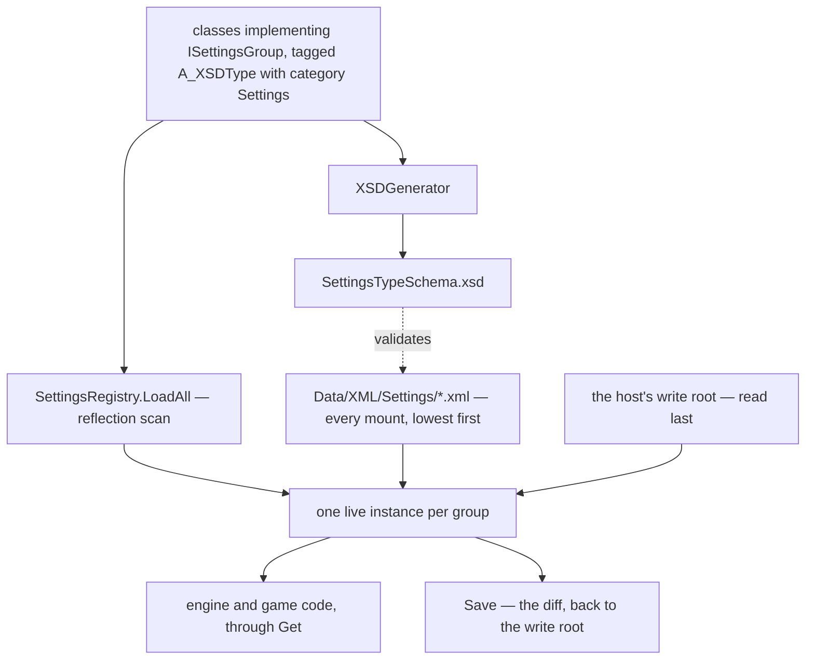

## Overview

The system that lets an engine, an application built on it, and the person using that application each have an opinion about the same value, and lets the last of those three survive the other two changing underneath it. A *settings group* is an ordinary C# class carrying the two attributes every serialized type in the engine already carries; the registry finds it by reflection, fills it from XML that cascades across the [[Virtual File System]]'s mounts, hands it to whoever asks, and writes back only what the user actually changed.

It is deliberately not an asset system. [[Asset Registries]] answers "give me the thing named X", where a thing that no manifest declares does not exist; settings answer "what is the value of X right now", where a value nobody has ever overridden is still a value. That difference is why discovery here is a type scan rather than a manifest read, and why a group with no file anywhere on disk is perfectly normal.

## Architecture



Three things feed a group and they arrive in a fixed order: the field initializers in the C# class, then every manifest the mounts carry, then the host's write root. Nothing that arrives later is obliged to be complete — each tier overrides only the attributes it names.

## Adding settings to a game

The whole cost is a class. There is no registration call, no manifest entry, and no file.

```C#
[A_XSDType("Difficulty", "Settings")]
public class DifficultySettings : ISettingsGroup
{
    [A_XSDElementProperty("EnemyHealth", "Settings")]
    public float enemyHealth { get; set; } = 1.0f;

    [A_XSDElementProperty("Permadeath", "Settings")]
    public bool permadeath { get; set; } = false;
}

bool permadeath = SettingsRegistry.Get<DifficultySettings>().permadeath;
```

`ISettingsGroup` carries no attribute of its own, exactly as `Block` doesn't — it is there to be the `allowedChildren` target [[XSDGenerator]] scans when it emits `UserSettings`, and the filter the registry's scan uses. Every group uses the `Settings` category so that one schema and one namespace cover all of them and one file can hold groups from unrelated systems; the grouping you care about is the type name, not the category.

The one trap is naming. XSD type names are a **flat namespace across every category** — `AnyXMLType.FindType` matches on name alone — so a group called `Document` would collide with `RichTextDocument`'s `[A_XSDType("Document", "UI")]` and the file would silently fail to resolve. Check before naming.

Shipping defaults for the group is a file in `Data/XML/Settings/`; not shipping one is equally valid and means the field initializers are the defaults. A host that wants its users to be able to change anything calls `SettingsRegistry.SetWriteRoot(path)` once, before `Engine.Init`, and `SettingsRegistry.Commit()` whenever a settings screen is dismissed.

## Two shapes of group

A group can hold its values two ways, and which one you want follows from whether the values are structured or need to be governed individually.

A **plain group** is the class above: typed C# members, each one an XSD attribute of its declared type, free to nest another type or carry a `List<>`. `DocumentSettings` is one, because it holds a `DocumentLayout` holding a list of text styles, and no flat list of named values expresses that.

A **`SettingCategory`** holds `Setting` children instead, and a `Setting` is its own type — its own element, carrying its own typed attributes. That is the reason to reach for it: a setting object has somewhere to put a `Scope` and an `OnChanged`, which are per value and which a plain member has nowhere to hold, and it can carry more than one number when one knob genuinely is two (a window's width and height are not two settings).

```C#
[A_XSDType("VSync", "Settings")]
public class VSyncSetting : Setting
{
    [A_XSDElementProperty("On", "Settings")] public bool on { get; set; } = true;
}

[A_XSDType("Graphics", "Settings", AllowedChildren = typeof(Setting))]
public class GraphicsSettings : SettingCategory
{
    public readonly DeviceSetting device = new DeviceSetting();
    public readonly VSyncSetting vsync = new VSyncSetting { onChanged = "Renderer.RequestSwapchainRebuild" };
}
```

Declaring a setting is a field and nothing else. `SettingCategory` collects its own `Setting`-typed fields on first use — after the derived class's initializers have run — so there is no registration call and no constructor, and the defaults are field initializers exactly as they are in a plain group. A category with no file anywhere still resolves.

Reads are typed the whole way down: `SettingsRegistry.Get<GraphicsSettings>().vsync.on` is a `bool` and no string literal appears anywhere between the declaration and the call site.

In XML a category is its settings, and a tier overrides the ones it names:

```xml
<Graphics>
  <Window Mode="Borderless" Width="1600" Height="900"/>
  <VSync On="false" Scope="App"/>
</Graphics>
```

A setting element is resolved against the category's **own fields**, not `AnyXMLType.FindType`, so a setting name only has to be unique inside its category. `<Window>` under `<Graphics>` is the settings type even though `WindowControl` owns `UI:Window` — the two live in different namespaces and the settings reader never does a global lookup. Category names still resolve globally and still have to be unique across every category.

### Build settings and user settings

`Scope` decides who is allowed to change a value. `User` means the write root may override it and `Save` writes it back; `App` means the build has decided, and a value in the user's file is read, recognised, and refused with a warning. That is per *setting*, not per file — one category can hold a graphics option the player owns next to one the build pins, which is the case the shape exists for: resolution and monitor are the reader's, the renderer the build ships with is not, and both belong under `Graphics`.

An `App` setting is therefore not absent from the schema — the same `SettingsTypeSchema.xsd` describes the engine's manifests, the application's, and the user's, and the engine's own manifest is where an `App` value is *declared*. What keeps it out of the user's file is `Save`, which never writes one. Typing one in by hand validates and then does nothing.

`Scope` and `OnChanged` are themselves read only from the engine's and the application's manifests, never from the write root. They are attributes on the `Setting` base type, so every setting's schema entry carries them; a user file that could name its own scope would simply promote itself out of the restriction, so the reader restores both after applying a write-root element. For the same reason `Save` never writes them back.

### Reacting to a change

`Setting.OnChanged` names an `[A_XSDActionDependency(..., "Settings")]` method, resolved by the same reflection scan [[Bootstrapper]] uses for its own steps. Nothing fires while values are being assigned — a settings screen mutates as much as it likes and then calls `SettingsRegistry.Apply()`, which compares every setting against the values it last handed out and invokes each distinct action **once**. A setting counts as moved when *any* of its own members moved, so a `Window` whose height alone changed fires its action the same as one whose mode did. Editing five options costs one swapchain rebuild rather than five, and loading a file at startup fires nothing at all, because `LoadAll` finishes by marking everything as already applied.

The one action that exists sets the flag the render thread already watches rather than rebuilding the swapchain itself — `Apply` runs on whoever called it, and tearing down a swapchain out from under a drawing thread is not a thing to do politely.

### Who fires it

The screen does. The registry cannot know when a person is finished, which is the whole reason the batch exists, so a settings UI mutates the live objects and then calls `SettingsRegistry.Commit()` — `Apply` followed by `SaveAll`, the actions and the persistence in one call, because they were two calls a screen had to remember and forgetting the second one produced a change that worked until the next launch. Both halves stay public: a host with no write root calls `Apply` on its own, since `Commit` inherits `SaveAll`'s refusal to run without one.

What `Commit` does **not** do is gate the value. The UI is writing to the live `Setting`, so a value is in effect the moment a widget moves and only the *action* waits for the call. There is therefore no Cancel — a screen that offers one has to restore the old values itself — and anything reading a setting mid-edit sees a half-edited category. In practice only `VSync` can be read late enough to notice. A working copy committed on OK would close both, the way [[Document Editing]] already edits a note, and is not built because a settings screen is not built.

Scope does not gate a runtime write either: `App` means the *file* cannot carry the value, not that code cannot set it. An App-scoped setting assigned in memory still fires its action and still never reaches the user's file, so a settings screen is what decides not to show it.

## The engine's own groups

`GraphicsSettings`, named `Graphics`, is the first group the engine ships itself, and it exists because values the renderer had hardcoded are the ones a person actually expects to be able to change before anything is drawn. It holds four settings — `Device`, `Monitor`, `Window` and `VSync` — and `Window` is the one that shows why a setting is a type rather than a name: mode, width and height are one decision about how the window is made, and splitting them into three named values only to read them back together was never expressing anything.

`Device`'s `Name` is matched case-insensitively as a substring of `VkPhysicalDeviceProperties.deviceName`, so `"RTX"` or `"Radeon"` is enough and the string a future settings screen lists is the same string the file holds; an empty value keeps the first device the driver enumerates, and a value matching nothing warns and falls back to that same first device rather than refusing to start. The alternative of a `vendorID:deviceID` pair is exact and survives a driver renaming the card, but it is unreadable to anyone hand-editing the file, and an index into the enumeration silently means a different GPU whenever the driver reorders it.

`Window`'s `Mode` is `Windowed`, `Borderless` or `Fullscreen`. The window is created undecorated in all three, so borderless is nothing more than a plain window sized and positioned to a monitor's video mode, and fullscreen is that same video mode handed to GLFW as an exclusive monitor. `Windowed` is the only mode that has a size of its own to be given.

`Width` and `Height` are that size, 1280x720 unless something says otherwise, and they are what `Windowed` opens at and what it is centred by. The other two modes ignore them and take the monitor's video mode instead. Placement follows `Monitor`: name one and the window is centred on it, name none and the window manager decides, exactly as it did before any of this existed. The values are read once, when the window is created — nothing resizes a live window, because a GLFW window call has to happen on the thread that made the window and an applied setting has no way to get there yet.

How the UI then fills whatever window that produced is a separate question, answered by the `WindowingMode` on the UI tree's root rather than here — the display says how big the window is, the tree says what to do about it.

`Monitor`'s `Name` is the panel name as Windows shows it — `"DELL"` picks the DELL U2414H — and empty means the primary monitor, as does a name matching nothing attached. It cannot come from GLFW: `glfwGetMonitorName` returns the *driver* description, which on Windows is "Generic PnP Monitor" for every panel in the machine at once, and Silk.NET does not bind the `glfwGetWin32Monitor` accessor that would map a monitor handle to a display directly. So the name is read from Windows and joined to the GLFW monitor by **virtual-desktop position**, which is unique per display because Windows does not let two displays occupy the same origin: `EnumDisplayDevices` walks the attached adapters, `EnumDisplaySettings` gives each one its position, and the adapter's monitor child carries the device interface path that `DisplayMonitor.FromInterfaceIdAsync` turns into the EDID name. When that lookup fails the GLFW name is used, so the match degrades to something useless rather than to a crash.

`VSync`'s `On` picks the preferred present mode and `FifoKhr` remains the fallback the specification guarantees: on, the swapchain asks for `MailboxKhr` and gets tear-free frames, which is what the renderer did unconditionally before the setting existed; off, it asks for `ImmediateKhr` and accepts tearing for latency.

This is the one Windows-only corner of the settings system, and it is confined to `DisplayNames` — the rest of the group, and everything the registry does, is platform-neutral.

The values are read exactly once, during bootstrap, by `ChoosePhysicalDevice`, `AGlfwWindow.CreateWindow` and `GetPresentMode`. Changing one takes an application restart, because nothing re-reads a group and nothing tells the renderer a value moved.

`InputSettings`, named `Input`, is the second, and it holds the two timings that were hardcoded inside [[INPUT]]: `DoubleClick`'s `Timeout` is the window within which a second press counts as the same tap sequence, and `KeyRepeat`'s `Delay` and `Rate` are how long a held key waits before it starts repeating and how fast it repeats once it has. Both are read live, at the point the value is used, rather than seeded into the tracker and the conditions at parse time — the read is a dictionary lookup on a handful of keys per tick, and seeding would have meant either a change that reaches nothing already parsed or an `OnChanged` action that walks every condition and cannot tell a keybind's deliberate override from the default it is about to clobber.

That is also why these are **global and a keybind cannot override them**: `Repeat` used to carry its own `Delay` and `Rate` attributes and they are gone. A per-keybind repeat rate is a different feature from a person's repeat rate, and the moment both exist there is no answer to what a settings screen is supposed to do to a keybind that named its own. `Hold`, `MaxHoldTime`, `HoldContinuous` and `MultiTap` keep their per-condition thresholds, because those describe what the gesture *is* rather than how fast the machine repeats.

## Lifecycle / Flow

1. `Settings.LoadAll` is the **first** step of the `Bootstrap` phase in [[Bootstrapper]], so every later step and everything at runtime can read a group without checking whether it is ready.
2. The scan constructs one instance per `ISettingsGroup` implementer across all loaded assemblies. Everything below this point is override.
3. Every mount's `Data/XML/Settings/*.xml` is applied, **lowest-priority mount first** — engine, then application — files within a mount in name order.
4. Every group is snapshotted. This is the baseline a save later diffs against, and taking it here is what makes "only what the user changed" mean the user and not the application.
5. The host's write root is applied last, and each group's stored element is kept for the save to read back.

`VirtualFileSystem.EnumerateAll` is deliberately not used for step 3: it de-duplicates by *file name*, so an application naming its file the same as the engine's would hide the engine's entire set rather than override the values it names. The registry walks `VirtualFileSystem.Mounts` in reverse directly.

## Resolution and merging

Scalars merge per attribute — an application that names `LineHeight` and nothing else keeps the engine's `BlockSpacing` and its whole style scheme. A nested complex member merges recursively onto the instance that is already there rather than replacing it.

A `List<>` member is the exception: the first file in a tier that declares any entry replaces the whole list. That is the rule [[Document Layout Engine]] already settled for text styles, and it is kept for the same reason — a scheme should be read as written, not merged entry-by-entry against entries its author cannot see and did not intend to inherit.

## Saving

`SaveAll` writes one `UserSettings.xml` into the write root holding every group, each carrying only what differs from the step-4 snapshot, so a user who changed one value pins one value and keeps receiving engine changes to everything else. A group with nothing to say is left out of the file entirely rather than written empty. A changed list is written whole, its entries still skipping their own type defaults. The write root is **not** a mount — mounting it would let a stray file there shadow engine *assets* and not just settings.

Saving is all-or-nothing because the file is: there is no `Save<T>`, since rewriting one group means rewriting the document that holds the others. Reading is not — the write root is still read as *every* `*.xml` in it, so a file left over from an earlier layout is still applied rather than orphaned. Nothing prunes it.

## Versioning and migration

Most ways a release changes the shape of a settings group need no mechanism whatsoever. A group that gains a member gets it from the field initializer, because the instance is built before any file is read and a user file that never named it says nothing about it. An enum that gains members still parses every name it used to. A brand-new group needs no file to exist at all.

What genuinely breaks a stored file is a name or a meaning moving out from under it: a member renamed, an enum member deleted, a 0–100 value becoming 0–1, a member moving to another group. None of that is inferable from the file, so a group that expects to change shape implements `IMigratableSettings` — an `int version`, and a `Migrate(int from, XElement stored)` that rewrites the stored element in place before anything on it is read. The rewrite is ordinary XLinq and the group spans its own versions, so there is no migration language and no step registry.

```
Migrate(from, stored):
    if from is below 2, rename the Vsync attribute to VerticalSync
    if from is below 3, divide Sensitivity by 100
```

A group migrates only when its stored element **carries** a `SettingsVersion` attribute lower than the group's own version. Hand-authored engine and application manifests never carry one and are therefore always read as current; `Save` stamps every migratable group, so user files always have one. `SettingsVersion` is reserved by the registry, and since [[XSDGenerator]] emits attributes from annotated members only it is the single attribute in a saved user file that the schema does not describe.

### Nothing the user owns is thrown away

An attribute in a user's file that no member claims is carried forward rather than dropped — `Save` starts from the fresh diff and copies back everything unclaimed, on the group element and recursively on nested members. A value survives a rename nobody wrote a migration for, and survives a setting that leaves in one release and comes back in another. A *known* attribute the writer chose to omit still drops out, so resetting a value to what the tiers below say still shrinks the file rather than pinning it forever.

A stored value that no longer converts at all — the enum member that was deleted — warns and leaves the member holding what it already had, instead of throwing. Before that tolerance existed such a value killed bootstrap at its very first step. It is asked for by the settings path alone: [[Document XML]] and the asset manifests still throw on a value they cannot read, because a note is not a file anyone hand-edits casually.

What is still not covered is a group **renamed or deleted outright**. The registry warns and skips, the user's whole file for it is orphaned, and `Migrate` cannot help because it is dispatched off a group that no longer resolves. Nothing prunes the write root either, so a dead group's file lingers.

## Data / XML formats

`Data/XML/Settings/*.xml`, any number of files, free filenames, unioned across mounts:

```xml
<UserSettings xmlns="http://arctisaurora/AuroraSettingsTypes"
              xmlns:UI="http://arctisaurora/AuroraUITypes">
  <DocumentSettings>
    <UI:DocumentLayout LineHeight="1.5" BlockSpacing="8">
      <UI:TextStyle Type="Heading1" FontSize="34"/>
    </UI:DocumentLayout>
  </DocumentSettings>
  <Graphics>
    <VSync Scope="App"/>
  </Graphics>
</UserSettings>
```

The root is `UserSettings` and not `Settings`: `XSDGenerator` already emits an `<xs:simpleType name="Settings">` per category that owns an enum, and a complexType of the same name in the same schema is a duplicate global type that XSD rejects outright. Freeing the name means renaming that emission across every category schema, which buys a word.

A group whose type lives in another category carries that category's prefix on its subtree — `DocumentLayout` is a `UI` type because notes embed it and moving it would change the namespace of every saved note. Groups declared in the `Settings` category need no prefix at all.

A saved user file is the same format with a version stamp: `<HarnessRender SettingsVersion="3" Msaa="8"/>`.

## Related
- [[Settings Registry]] — the class: API, method shapes, the snapshot and diff machinery
- [[Virtual File System]] — the mount order the cascade walks
- [[Asset Registries]] — the manifest pattern this mirrors, and where the two systems part company
- [[Bootstrapper]] — `Settings.LoadAll` is the first step of the `Bootstrap` phase
- [[Document Layout Engine]] — `DocumentSettings`, the first consumer
