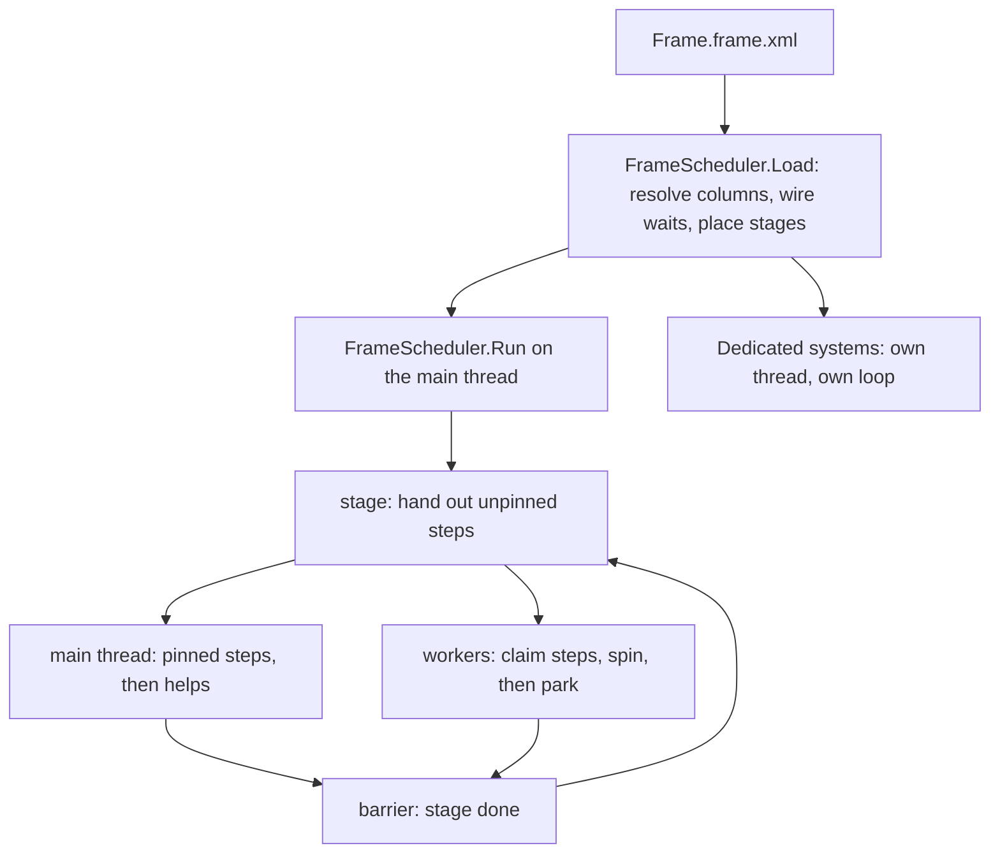

## Overview

Every engine system is a step of one frame graph. The main thread runs the frame: the graph is split into stages, the steps of a stage run at the same time, and any free thread takes the next step. When a stage is done, everyone moves on to the next one together, so more cores means more helpers and nothing else changes.

A system listed as dedicated is the exception. It gets a thread of its own and runs at its own pace, outside the stages, and nothing in the graph ever waits for it. Render is dedicated, because it spends most of its time waiting on the GPU and would otherwise tie up a helper.

Pools have no owner. Each step says which columns it reads and which it writes, and the order of the stages is worked out from that — a reader waits for everything that writes its column, and two writers of one column take turns in the order they are listed.

## Architecture



## The frame graph

`Frame.frame.xml` lists the dedicated systems and the steps. A step names a system, whether it must run on the main thread, and the columns it touches. A column is written `Pool` for every column of a pool, or `Pool.Component` for one column, with the component type spelled the way `Pools.pools.xml` spells it.

```xml
<FrameGraph xmlns="http://arctisaurora/AuroraSystemsTypes">
	<Dedicated System="Render"/>
	<Step System="Main" Pinned="true" Writes="UIElements UIQuads Entities Gradients Effects"/>
	<Step System="Animation" Writes="Paints Animations Signals Keyframes"/>
	<Step System="Physics"/>
</FrameGraph>
```

Main is always pinned, because GLFW requires its events to be polled on the thread that created the window. Main cannot be dedicated, and a system may appear only once. A system that appears nowhere never runs, and the log says so at startup.

## How the stages are worked out

`FrameScheduler.Load` turns the list into waits, then places each step one stage after the latest step it waits for. A column a step both reads and writes counts as a write. Stages keep the order of the list.

```
Wire(steps):
	for each step:
		for each other step:
			for each pool:
				clash = columns step only reads that other writes
				if other is listed before step:
					clash += columns both write
				if clash:
					step waits for other, because of the first clashing column

Place(steps):
	start with the steps that wait for nothing
	for each step whose waits are all placed:
		step.stage = 1 + latest stage among its waits
	if a step is never placed:
		throw, naming the loop of waits and the column behind each one
```

A loop is a mistake in the XML and stops the engine at startup, with a message such as `Main waits for Animation (Paints.GpuPaint) → Animation waits for Main (UIElements.ArrangeData)`. Two systems that really need each other's data will read one side through a mailbox pool, which holds last frame's copy, once mailboxes exist.

The startup log prints the stages, for example `stage 1: Main (main thread), Animation, Physics`.

## Running a frame

The main thread runs the frame loop until the engine stops. A system with a period, such as physics at 32 ms, runs at most once per period and at most once per frame; every other step runs every frame.

```
Run():
	start every graph system
	while running:
		for each stage:
			RunStage(stage)
		frame += 1
		wait out the rest of the frame cap, if one is set

RunStage(stage):
	for each step in stage:
		step.due = its period has come round
		if due and not pinned:
			put it in the hand-out list
	publish the hand-out list as one word: count and next index
	wake as many parked workers as there are steps, at most
	for each pinned due step:
		run it on the main thread
	while steps are still unfinished:
		claim one and run it, or spin briefly
```

A step is claimed by swapping the hand-out word forward by one. The count sits in the same word as the index, so a worker holding a stale index can never claim a slot of the next stage while the main thread is still filling it.

```
Work():
	while running:
		if a step can be claimed:
			run it
			mark it finished
		else if idle for less than 50 µs:
			spin
		else:
			park until the main thread wakes it
```

Running a step sets which step and which system are running on that thread, drains the system's inbox, calls its `Tick`, publishes its outbox, and bumps its epoch. Nothing in a frame allocates.

## Who may touch a pool

In a Debug build every pool entry point checks the step running on the calling thread. `GetSpan`, `GetRef`, `CopyFrom` and `UpdateRange` write one column; `Allocate`, `Free`, `Rewind`, `Append` and `FrameEdge` write every column; the dirty marks write some column; `Backing`, `CopyTo`, `CopyRange` and `OwnerAt` read one. A step that touches a column it did not list throws on the spot, naming the pool, the call and the step. Outside a step nothing is checked, except that a dedicated thread may only read — this is how the render thread reaches the pools at all.

`DataManager.FrameEdge()` compacts, grows and re-sequences every pool the running step writes in full.

## Settings

The `Threading` settings group has two settings, both per user.

| Setting | Values |
|---|---|
| `Threads Count` | `0` uses every logical core the dedicated threads leave; `1` runs the whole graph in order on the main thread; any other number uses that many threads, main included. Read at startup. |
| `FrameCap MaxFps` | `0` is uncapped; anything else caps the graph and every dedicated thread. Read every frame. |

With `Threads` at 1 the dedicated threads still keep their own cores; only the graph becomes linear. That mode exists for profiling: a system that is slow on one core is fixed before threads are considered. The cap sleeps in 1 ms steps until 2 ms remain, then spins.

## Profiling

The main thread's frames land in the `Main` lane and each worker's in `Worker N`, all numbered by the frame counter, so the lanes line up in [[PROFILING]] captures. A worker opens a frame record on the first step it runs in a frame. Each step is wrapped in a `Step.<System>` zone, and the main thread's wait at the end of a stage is `Scheduler.Barrier`.

## Gotchas

- Physics runs at most once per frame, so below about 31 fps it slows with the frame.
- Dragging a window by its native title bar blocks the main thread inside its step, so the whole graph pauses; render keeps drawing.
- Uncapped is the default, so an idle app keeps two cores busy — the main loop and render. Set `MaxFps` if that is unwanted.
- The graph can run ahead of render and compute frames nobody sees, until render reads from a copy made at the end of each frame.
- Message lanes between systems still exist and are going away; see `ClaudeMemory/Context/frame-scheduler-plan.md`.
