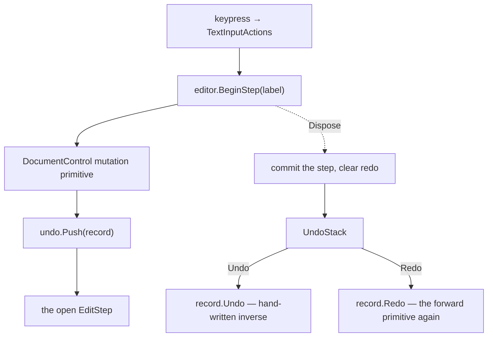

## Overview

Undo is a stack of steps, a step is a list of records, and a record is plain data that knows how to reverse one change. The stack itself knows nothing about documents — it holds `IEditRecord`, and the records that implement it live next to the thing they edit, so the same stack will carry the game editor's transforms and reparents when that arrives.

One user action is one undo step, however many primitives the action ran. Nothing coalesces: a keypress is a step, so typing five letters is five undos.

## Architecture



### The two rules

**Redo replays the forward operation.** After an undo the document is back in its pre-edit state, so the addresses recorded before the edit resolve again and the primitive can simply run a second time. `DeleteRangeEdit.Redo` is `DeleteRange(from, to)`, the same call the keypress made. Only the undo direction is a second implementation, which is where the risk of a precise inverse actually lives.

**Every conditional in the forward code becomes a recorded bit.** A delete keeps an emptied head run but destroys an emptied tail run, and a split drops its carried clone when it is empty and other runs moved in. The inverses never re-decide either of those — they read a flag written from the branch that actually ran. Change a forward rule later and records made under the old one still reverse correctly.

Because redo re-enters the recording primitives, `UndoStack` holds an `_applying` flag while it is reversing or replaying, and a `Push` inside that window is dropped. Without it, a redo would grow the undo stack while consuming the redo stack.

### Steps and scopes

An `EditScope` is what makes one press one undo. It matters even without coalescing, because a single action already runs more than one primitive: typing over a selection deletes it and then writes, and Enter deletes the selection and then splits. Recorded separately, Ctrl+Z would put the deleted text back and leave the typed characters sitting there.

```
Begin(label):
    if this is the outermost scope:
        open a new step
    return a scope that ends it on Dispose

End():
    if an inner scope is still open:
        return
    if the step recorded nothing:
        drop it
    push it, clear the redo list, evict the oldest past 500 steps
```

Scopes open where one press is visible. `DocumentEditorControl.Backspace`, `Delete` and `SplitBlock` are one-to-one with an action and open their own; `Text.Write` is not, because it is bound `<Continuous/>` and drains the whole character queue in one call, so it opens one scope per character inside its loop.

### Addressing

`Entity.Destroy` is one-way — it detaches, flags, and queues the subtree for the frame edge — so a record cannot keep a run and re-attach it later. Every record addresses by index instead: `DocumentAddress` is a block index, a run index inside that block, and a character offset, resolved against the live tree each time.

Indices survive a reversal by construction. A delete leaves the head run on the block and run index it already had, and the inverse rebuilds the tail block with its own destroyed runs ahead of the tail run, so the tail run lands back where it was.

### Records

| Record | Covers | Undo | Redo |
|---|---|---|---|
| `RunTextEdit` | typing, and any delete inside one run | splice the text back in, or back out | the mirror splice |
| `DeleteRangeEdit` | a delete crossing a run or block boundary | `InsertFragment(from, fragment)` | `DeleteRange(from, to)` |
| `SplitEdit` | Enter | `JoinBlockWithNext` | `SplitBlockAt(at)` |
| `StyleRangeEdit` | Ctrl+B/I, and every pick on the format bar | `RestoreBlocks(firstBlock, before)` | `ApplyStyleBetween(from, to, delta)`, or `SetBlockStylingBetween` |

### Fragments

A `DocumentFragment` is the content a delete removed and nothing else — the surviving context around it is never copied, which is why a Backspace that merely crosses a run boundary costs about ten bytes rather than two copies of the paragraph it sat in.

The layout is fixed: the first snapshot run is always the text cut out of the head run, the last is always the text cut out of the tail run, and everything between is a run that was destroyed whole, grouped into one snapshot per block the range touched. More than one block in the fragment means the range crossed a block boundary.

```
InsertFragment(at, fragment):
    resolve at -> the head run and an offset into it
    splice the first snapshot run's text back into the head run
    rebuild the head block's whole runs after it
    if the fragment is one block:
        put the tail text back on the run that follows, creating it when the delete destroyed it
        return
    rebuild the blocks the range crossed whole
    build the tail block from its own snapshot runs
    move the survivors the merge pulled into the head block back out into it
    insert every rebuilt block after the head block, re-running ApplyLayout on each
```

This is the same shape a cut or a paste wants, and paste will be the first thing to exercise it outside undo.

### History ownership

The stack hangs off `DocumentEditSession`, so it is per open note. Tabs already give two live sessions and a global stack would let Ctrl+Z in one tab reach the note in another. An editor with no session hands back a default scope, which discards whatever is pushed into it.

## Lifecycle / Flow
1. A keybind reaches `TextInputActions`, which resolves the focused `DocumentEditorControl` the same way every other text action does.
2. A scope opens, either in the editor's own editing method or in the typing loop.
3. The mutation primitive on `DocumentControl` records what it is about to do — the data it is about to destroy, and the branch it took — then does it.
4. The scope closes, the step lands on the undo stack, and the redo list is cleared.
5. Ctrl+Z pops a step and runs its records in reverse, so the caret restore that stands belongs to the first record made.
6. Ctrl+Y pops from the redo list and runs the same records forward, replaying the original primitives.

## Data / XML formats

```xml
<Keybind Trigger="Z" Action="Text.Undo">
	<Modifier Key="LeftControl" />
	<Press />
</Keybind>

<Keybind Trigger="Y" Action="Text.Redo">
	<Modifier Key="LeftControl" />
	<Press />
</Keybind>
```

`<Press/>` rather than `<Repeat/>`: the repeat rate is 10 ms, and with a step per keypress a held Ctrl+Z would burn a hundred steps a second. `Ctrl+Shift+Z` as a second redo bind works only if it is declared ahead of `Ctrl+Z`, because [[INPUT]] evaluates modified binds in list order and only shadows the later, less specific one — so it is left out rather than made order-dependent.

## Known gaps

Nothing has been undone by hand yet — the feature builds and binds, and that is all that has been checked. `InsertFragment` is the piece to distrust: it exists only as the inverse of a delete and nothing else calls it, so the cross-block case with a destroyed tail run has never run.

Holding Backspace produces one step per repeat firing, which is what one-press-one-undo means and the first thing a coalescing pass would change. Undo restores the caret but not the selection, and does not reach a standalone `TextBoxControl`, where Escape is still the only way back. It does scroll to the caret it restores, through the deferred request described in [[Rich Text Document#Scrolling to the caret]].
