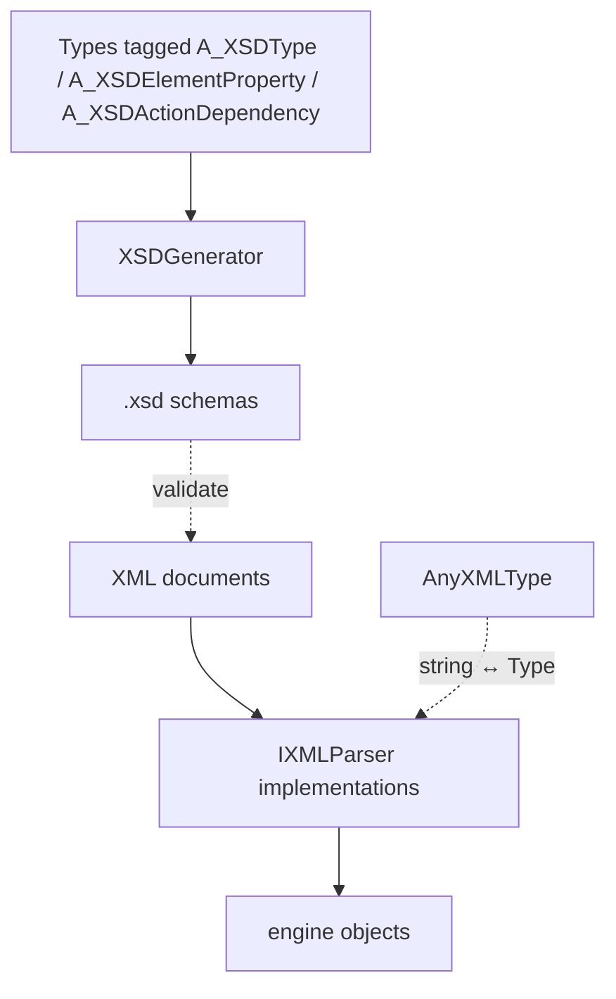

## Overview

The data layer that lets the engine be driven by XML. It has two halves:
1. **Schema generation** — reflect over types tagged with the `A_XSD*` attributes and emit `.xsd` schemas describing the allowed XML.
2. **XML parsing** — parse XML documents (validated against those schemas) into live engine objects.

Almost everything configurable rides on this: the [[Asset Registries]] definitions, the UI tree ([[Vulkan Control]]), keybinds ([[INPUT]]), the [[Bootstrapper]] sequence, and samplers. The C# type *is* the schema — there is no hand-authored XSD.

## Architecture

- **`A_XSDType(name, category)`** — marks a class/struct/enum as an XSD type (supports `AllowedChildren`, `Min/MaxChildren`). See [[Attributes & Conventions]].
- **`A_XSDElementProperty(name, category)`** — a member becomes an XSD attribute (scalars) or element (collections).
- **`A_XSDActionDependency(name, category)`** — a method becomes a referenceable action (keybinds, bootstrap steps).
- **`XSDGenerator`** — emits the schemas. **`AnyXMLType`** — resolves type-name strings ↔ `Type` at parse time. **`IXMLParser<T>`** — the parse contract systems implement.

## Lifecycle / Flow
1. At startup (before bootstrap) `XSDGenerator.GenerateXSD()` reflects all assemblies and writes the schemas to `Paths.XMLSCHEMAS` (skipping unchanged ones).
2. Each system then parses its own XML through the [[Bootstrapper]] steps — `EntityRegistry`, `AssetRegistries`, `InputHandler`, `VulkanControl`, all using `AnyXMLType` to resolve type names.

## Data / XML formats
Generated per run:
- `{Category}TypeSchema.xsd` — complex + enum types for one category
- `AllTypesSchema.xsd` — union of all type names across categories
- `actionSchema.xsd` — all `[A_XSDActionDependency]` methods as string enumerations

## Invariants & gotchas
- **Do not hand-edit** generated `.xsd` files — overwritten each run.
- `MemberMap` (C# primitive → `xs:*`) and `AnyXMLType.typeMap` (string → `Type`) are two halves of one mapping and must be kept in sync by hand.
- An `Action` attribute only resolves if the XML name matches the method name exactly (known sharp edge tracked in the engine WIP list).

## Key types
- [[XSDGenerator]] · `AnyXMLType` · [[IDeserialize]] / `IXMLParser`

## Related systems
- [[Bootstrapper]] · [[Asset Registries]] · [[INPUT]] · [[Vulkan Control]]
